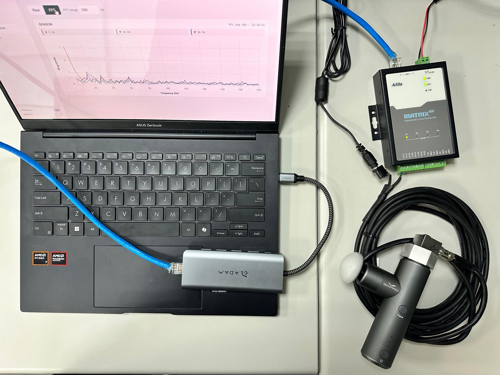

# Matrix-800 ISO 20816 振動 Gateway

[English](README.md) · **繁體中文**

適用於 **Matrix800** 閘道器的即時振動監測與動作分類器。三軸加速度計透過
Modbus RTU 串流原始 XYZ 資料 → 凍結的 CNN 骨幹網路在 NPU 上執行 → 餘弦相似度
分類頭標記動作 → 即時 Flask 儀表板顯示波形、FFT、感測器指標與分類結果。本版本另將
三軸 Velocity RMS 對照 **ISO 20816-3:2022**，顯示 A/B/C/D Zone、門檻與告警狀態。

ISO 功能的部署、量測前提與機台設定請先閱讀
[ISO 20816 部署指南](docs/iso20816.zh-TW.md)。系統不會自動停機。

若要把整包移到另一台電腦，請從
[可攜式交接手冊](HANDOFF.zh-TW.md) 開始；其中包含 Windows 網路設定、實機資訊、
無 Sensor 測試、Gateway 部署與 systemd 步驟。

**查看實際介面**：[api.md → 頁面細節](docs/api.zh-TW.md#page-details)。

<p float="left">
    
</p>

## 快速開始

```bash
git clone https://github.com/pogJames/accelerometer-demo
python -m venv .venv
source .venv/bin/activate
pip install -r requirements.txt
python app.py                   # http://<board-ip>/
```

尚未接 sensor 時，可用一般帳號在 8080 埠安全測試網頁：

```bash
MATRIX800_SENSOR_PORTS='' MATRIX800_SIMULATE=1 MATRIX800_HTTP_PORT=8080 python3 app.py
```

模擬器預設每 10 秒循環 A/B/C/D。也可手動指定 Velocity RMS：

```bash
curl -X POST http://127.0.0.1:8080/api/simulator \
  -H 'Content-Type: application/json' \
  -d '{"velocity_mm_s":3.5}'
```

在實機上，請**先設定 NPU 驅動程式**——這是設錯就會無聲失敗的關鍵步驟。
請見 [getting-started.md](docs/getting-started.zh-TW.md#3-choose-your-npu-driver)。

## 頁面

| 網址 | 顯示內容 |
|---|---|
| `/` | 即時波形——原始捲動 + FFT 頻譜，每個感測器一個 |
| `/inference` | 即時分類卡片（對最近 7 個視窗做多數決） |
| `/metrics` | 每個感測器的指標表及 ISO 20816 A/B/C/D Zone |
| `/record` | 錄製原始 XYZ 至 `data/<label>.bin` |
| `/train` | 訓練分類頭（2 個以上標籤，數秒完成） |
| `/settings` | 埠名稱、額定功率、RPM、支撐型式及告警穩定化設定 |

## 五行架構

三個 worker，以佇列解耦：

```
W1 sensor_reader.py  → 佇列 →  W2 inference.py  →  W3 app.py
   (每個埠一個子行程)             (NPU 分類)          (Flask + SSE)
```

W1 在自己的行程中讀取 Modbus（序列迴圈受 GIL 綁定）。W2 在 NPU 上執行凍結的
int8 骨幹網路。W3 把一切接起來，並透過 SSE 把快照推送到瀏覽器。推論模式為
`npu`（實機）或 `stub`（缺少執行環境／模型／delegate——儀表板仍可顯示）。
沒有 CPU 後備。

## 文件

| 文件 | 用途 |
|---|---|
| [getting-started.md](docs/getting-started.zh-TW.md) | 從零在 Matrix800 上執行 |
| [api.md](docs/api.zh-TW.md) | 用於延伸開發的 HTTP/SSE API |
| [architecture.md](docs/architecture.zh-TW.md) | 系統如何運作、為何這樣設計 |
| [modules.md](docs/modules.zh-TW.md) | 各檔案的內部設計註記 |
| [iso20816.zh-TW.md](docs/iso20816.zh-TW.md) | ISO 20816-3 設定、API 與 Gateway 部署 |
